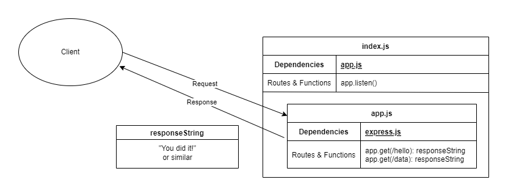

# Server Deployment Practice

This is the repo for Code 401 Lab 1. It's purpose is to provide an opportunity to practice "Continous Integration" testing and deployment, which are new workflows we've just been taught.

## Author: Jeffrey Jenkins

## Setup

1. Clone repo to local.
2. Run `npm i`.
3. Assign `.env`  variables.
      - `PORT` - port number (optional)

### Running the app

1. Run `npm start`
2. Endpoints:
    - `/data`: Returns status 200 with a plain-text response body.
    - `/hello`: Returns status 200 with a plain-text response body.

### Tests

1. Run `npm test`.

## UML

Created with [Diagrams.net](https://app.diagrams.net/)

